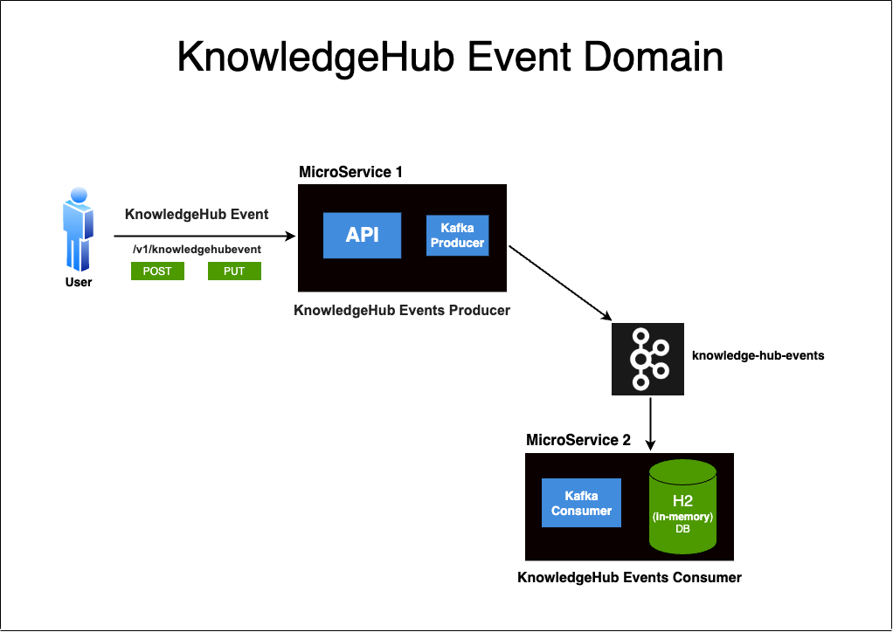
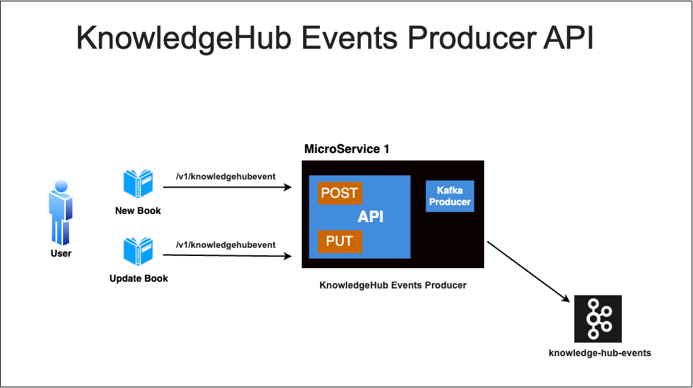
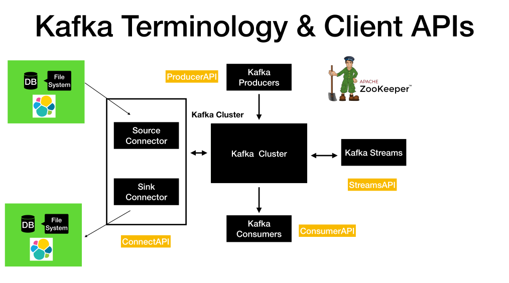
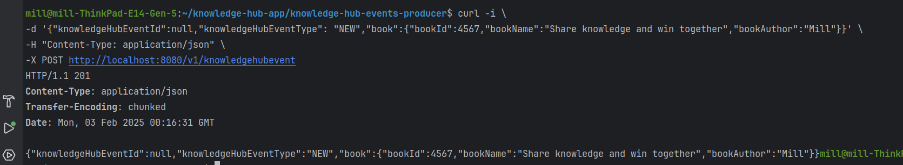
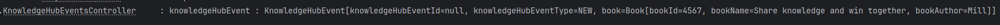
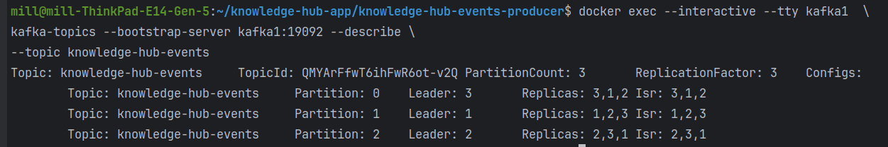

# library-knowledge-hub






## Set Up Kafka in Local using Docker



## Set up a Kafka Cluster with 3 brokers and zookeeper

- Navigate to the path where the **docker-compose-multi-broker.yml** is located and then run the below command.

```
docker compose -f docker-compose-multi-broker.yml up
```

## Run KnowledgeHubEventsProducerApplication

```
mvn spring-boot:run
```

### POST WITH-NULL-Knowledge-Hub-Event-ID

```
curl -i \
-d '{"knowledgeHubEventId":null,"knowledgeHubEventType": "NEW","book":{"bookId":4567,"bookName":"Share knowledge and win together","bookAuthor":"Mill"}}' \
-H "Content-Type: application/json" \
-X POST http://localhost:8080/v1/knowledgehubevent
```



### KnowledgeHubEvent



### List the topics in a cluster

```
docker exec --interactive --tty kafka1  \
kafka-topics --bootstrap-server kafka1:19092 --list
```


### Command to describe a specific Kafka topic

```
docker exec --interactive --tty kafka1  \
kafka-topics --bootstrap-server kafka1:19092 --describe \
--topic knowledge-hub-events
```



### Command to Consume Messages from the topic.

```
docker exec --interactive --tty kafka1  \
kafka-console-consumer --bootstrap-server kafka1:19092 \
                       --topic knowledge-hub-events \
                       --from-beginning
```


#### Log files in Multi Kafka Cluster

- Log files will be created for each partition in each of the broker instance of the Kafka cluster.

-  Login to the container **kafka1**.
  ```
  docker exec -it kafka1 bash
  ```
-  Login to the container **kafka2**.
  ```
  docker exec -it kafka2 bash
  ```

- Shutdown the kafka cluster

  ```
  docker compose -f docker-compose-multi-broker.yml down
  ```

#### Log file and related config

- Log into the container.

```
docker exec -it kafka1 bash
```

- The config file is present in the below path.

```
/etc/kafka/server.properties
```

- The log file is present in the below path.

```
/var/lib/kafka/data/
```


#### How to view the commit log ?

```
docker exec --interactive --tty kafka1  \
kafka-run-class kafka.tools.DumpLogSegments \
--deep-iteration \
--files /var/lib/kafka/data/test-topic-0/00000000000000000000.log
```
